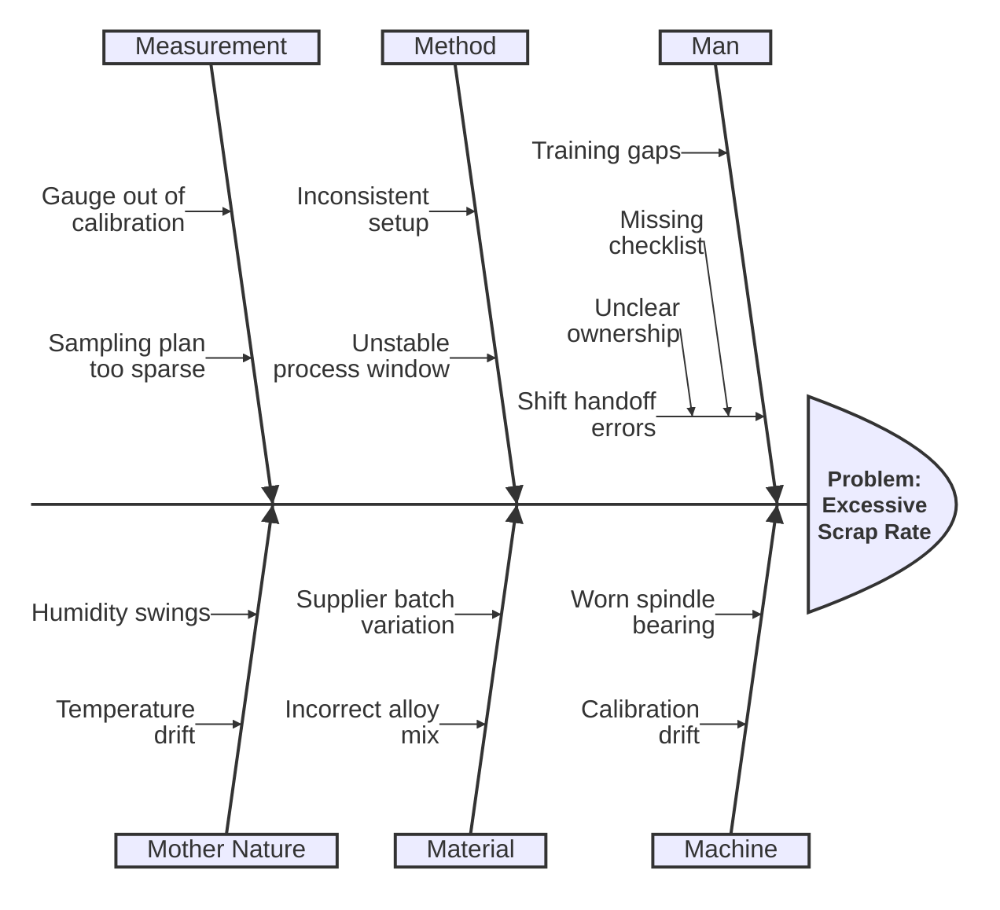
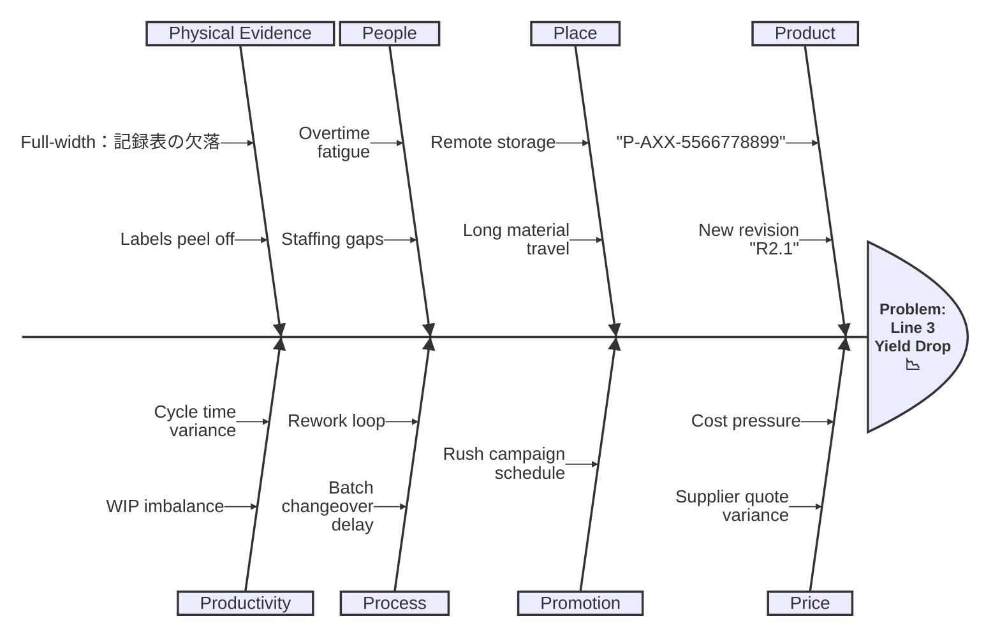

# Ishikawa (Fishbone)

> Ishikawa diagrams use a mindmap-style indentation tree to describe causes and sub-causes for a root problem.

## Example: 6M (Manufacturing)

## Example: 8P with mixed labels

